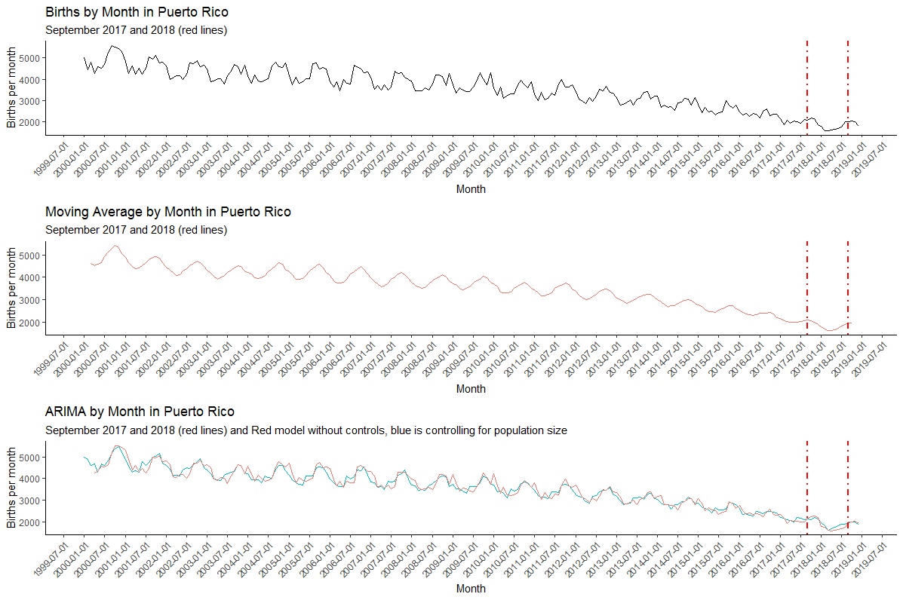

# Births in Puerto Rico - emphasis in Hurricane Maria
*This code, includes comments, allows you to replicate my time-series analysis of Births in Puerto Rico. With special interest in whether there is a "baby bump" after Hurricane Maria.*

